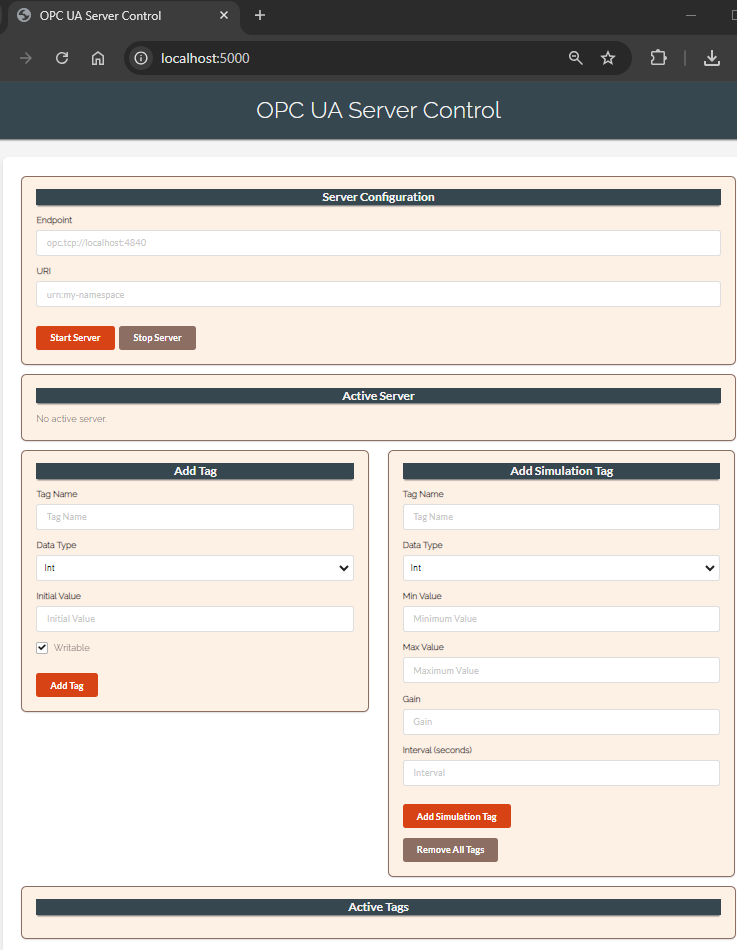

# OPC UA Server Control Application

This is a Python-based OPC UA server control application that provides a web interface for managing OPC UA tags, adding simulation tags, and monitoring active server configurations. The web interface is built using Flask and the server is managed with the Python `opcua` library.

## Features

- **Start and Stop OPC UA Server**: Easily start and stop the OPC UA server through the web interface.
- **Add Tags**: Add various types of tags (int, float, string, boolean) to the OPC UA server.
- **Add Simulation Tags**: Create simulation tags that vary between defined ranges over time.
- **Remove Tags**: Remove individual tags or all tags from the server.
- **Persistent Tag Configuration**: The server's state, including all tags, is saved in a JSON file and automatically loaded when the server starts.
- **Web Interface**: Manage the server and tags through a modern, responsive web interface.

## Usage
1. **Run the server**: Download and run the executable file from the "/dist/opcua_server.exe "
2. **Start the Server**: Navigate to `http://localhost:5000` in your web browser and configure the server by providing an endpoint and URI.
3. **Manage Tags**: Add, view, and remove tags using the web interface.
4. **Add Simulation Tags**: Set up tags that automatically change over time within a defined range.
5. **Stop the Server**: Stop the server using the "Stop Server" button in the web interface.

## Project Structure

```
.
├── opcua_server.py             # Main Python script that runs the OPC UA server and Flask application
├── dist/            # HTML templates for the Flask application
│   └── opcua_server.exe
├── templates/            # HTML templates for the Flask application
│   └── index.html
├── server_state.json     # JSON file where the server state is saved
├── requirements.txt      # Python dependencies for the project
└── README.md             # Project documentation
```


## Installation

### Prerequisites

- Python 3.x
- pip (Python package installer)

### Clone the Repository

```bash
git clone https://github.com/DanteDevOps/opcua-server-control.git
cd OPCUA_Simulator_mini
```

### Install Dependencies

Install the required Python packages using pip:

```bash
pip install -r requirements.txt
```

### Running the Application

To start the application, run the following command:

```bash
python opcua_server.py
```

The server will start in debug mode and be accessible at `http://localhost:5000`.

## Creating an Executable

To create a standalone executable of the application, use PyInstaller:

1. Install PyInstaller:

    ```bash
    pip install pyinstaller
    ```

2. Generate the executable:

    ```bash
    pyinstaller --onefile --add-data "templates;templates" --add-data "server_state.json;." server.py
    ```

3. The executable will be generated in the `dist` folder.


## License

This project is licensed under the MIT License. See the `LICENSE` file for more details.

## Acknowledgments

- **Flask** - Web framework used for building the web interface.
- **opcua** - Python package for OPC UA communication.
- **PyInstaller** - Tool for creating standalone executables from Python scripts.

## Contributing

Feel free to fork this repository and submit pull requests. Any contributions, whether for bug fixes or new features, are greatly appreciated!

---

For any issues or feature requests, please open an issue on [GitHub](https://github.com/DanteDevOps/OPCUA_Simulator_mini/issues).
```

